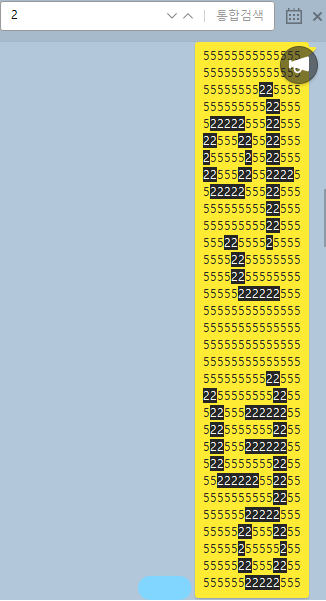

# 카카오톡 비밀 메시지
 
위와 같이 검색해야 볼 수 있는 비밀 메시지를 만들어보세요.
## 사용법 Usage
`index.html?msg=메시지` 
[예시: 안녕](https://km19809.github.io/figlet/index.html?msg=)
## Credits
* [figlet-js](https://github.com/patorjk/figlet.js/) for render figlet font
* [Sam3KR-16](https://github.com/hurss/fonts) for font
* bdf2flf by John Cowan <cowan\@ccil.org> for convert bdf to flf